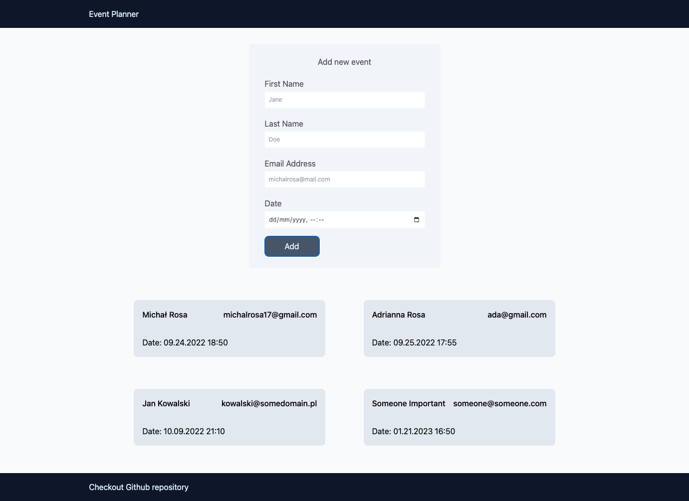

# Event App

**App that allows users to add events to the database, and display them.**

Simple app functionality allows to focus on setting up proper structures for full-stack application.

# Table of Contents

- [Event App](#event-app)
- [Table of Contents](#table-of-contents)
  - [Structure](#structure)
  - [Backend](#backend)
  - [Frontend](#frontend)
  - [Running app locally](#running-app-locally)
  - [Running Tests](#running-tests)
    - [BE](#be)
    - [FE](#fe)

## Structure

Application as a monorepo, shares files of backend and frontend. The root directory contains the whole code and setup for the backend. In the root directory, you can find also the frontend directory with its code and setup.
FE and BE are separate by their own config e.g. tsconfig.json. package.json. The project uses node in ver 17.8.0 and pnpm in ver 7.11.0.

## Backend

App uses Express.js as a node.js framework and PostgreSQL with TypeORM as a database. The app structure follows the three-layer architecture.

- Controller layer - for controlling HTTP request/response
- Service Layer - for controlling business logic
- Data Access Layer - for communication with the database

For testing the server, app uses jest.

## Frontend

The client was set up with Vite.js and React.js as a framework. For styles, the app uses Tailwindcss framework. It's a classic Single Page Application/Client Side Rendered app. The src components contain separate directories for components, layouts, and views. To handle form validation app uses a library called Formik with Yup Schemas.

For testing the client, app uses vitest with react-testing-library.

## Running app locally

- run docker contanairs
  > `docker-compose up`

## Running Tests

### BE

    In root directory run following command:

- run tests
  > `pnpm test`

### FE

    In root directory run following commands:

- navigate to frontend directory

  > `cd frontend`

- run tests in watch mode
  > `pnpm test`
